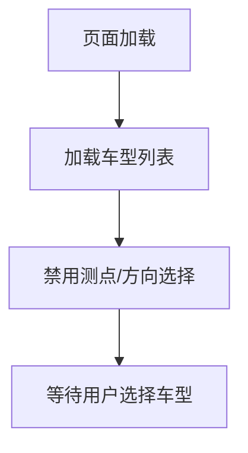
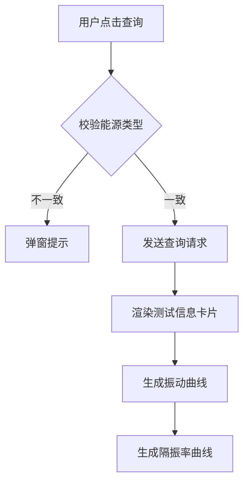

# 整车悬置隔振率测试系统重构需求文档
相关文件后端"D:\pythonProject\zlbbses\nvh_django\backend\apps\dynamic_stiffness";前端"D:\pythonProject\zlbbses\nvh_django\frontend\src\views\business\VehicleMountIsolationQuery.vue";"D:\pythonProject\zlbbses\nvh_django\frontend\src\store\vehicleMountIsolationQuery.js"
## 一、系统概述

### 1.1 界面布局
系统界面分为四个核心区域：
1. **筛选条件区**：车型、测点、方向多选筛选
2. **测试信息区**：选中车型的测试基本信息卡片展示
3. **振动曲线区**：主动端/被动端振动加速度对比图表
4. **隔振率曲线区**：隔振率性能分析图表

---

## 二、数据模型设计

### 2.1 VehicleMountIsolationTest（测试基本信息表）

```python
class VehicleMountIsolationTest(models.Model):
    """整车悬置隔振率测试基本信息表"""
    
    vehicle_model = models.ForeignKey(
        VehicleModel, 
        on_delete=models.CASCADE, 
        verbose_name='车型'
    )
    test_date = models.DateField(
        null=True, 
        blank=True,
        verbose_name='测试时间'
    )
    test_location = models.CharField(
        max_length=100, 
        null=True, 
        blank=True, 
        verbose_name='测试地点'
    )
    test_engineer = models.CharField(
        max_length=50, 
        verbose_name='测试人员'
    )
    energy_type = models.IntegerField(
        choices=[(0, '燃油'), (1, '纯电/混动')],
        default=0,
        verbose_name='能源类型'
    )
    test_condition = models.CharField(
        max_length=200,
        null=True, 
        blank=True,
        verbose_name='测试工况'
    )
    
    class Meta:
        db_table = 'vehicle_mount_isolation_test'
        verbose_name = '整车悬置隔振率测试'
        verbose_name_plural = verbose_name
        ordering = ['-test_date']
        indexes = [
            models.Index(fields=['vehicle_model', 'energy_type'])
        ]
```

**字段说明：**
- `energy_type`：0=燃油车，1=纯电/混动车（影响横轴单位）
- `test_condition`：测试工况描述（如WOT全油门加速）

---

### 2.2 MountIsolationData（测试数据表）

```python
class MountIsolationData(models.Model):
    """悬置隔振率测试数据表"""
    
    test = models.ForeignKey(
        VehicleMountIsolationTest,
        on_delete=models.CASCADE,
        related_name='isolation_data',
        verbose_name='关联测试'
    )
    measuring_point = models.CharField(
        max_length=100,
        verbose_name='测点名称'
    )
    
    # 横坐标数据（根据能源类型自动解释）
    speed_or_rpm = models.JSONField(
        verbose_name='速度或者转速'
    )
    
    # X方向完整数据链
    x_active = models.JSONField(verbose_name='X方向主动端振动(m/s²)')
    x_passive = models.JSONField(verbose_name='X方向被动端振动(m/s²)')
    x_isolation = models.JSONField(verbose_name='X方向隔振率(dB)')
    
    # Y方向完整数据链
    y_active = models.JSONField(verbose_name='Y方向主动端振动(m/s²)')
    y_passive = models.JSONField(verbose_name='Y方向被动端振动(m/s²)')
    y_isolation = models.JSONField(verbose_name='Y方向隔振率(dB)')
    
    # Z方向完整数据链
    z_active = models.JSONField(verbose_name='Z方向主动端振动(m/s²)')
    z_passive = models.JSONField(verbose_name='Z方向被动端振动(m/s²)')
    z_isolation = models.JSONField(verbose_name='Z方向隔振率(dB)')
    
    layout_image_path = models.CharField(
        max_length=255,
        null=True,
        blank=True,
        verbose_name='测试布置图路径'
    )
    
    created_at = models.DateTimeField(auto_now_add=True, verbose_name='创建时间')
    updated_at = models.DateTimeField(auto_now=True, verbose_name='更新时间')
    
    class Meta:
        db_table = 'mount_isolation_data'
        verbose_name = '悬置隔振率测试数据'
        verbose_name_plural = verbose_name
        unique_together = [['test', 'measuring_point']]
        indexes = [
            models.Index(fields=['test', 'measuring_point'])
        ]
```

**数据结构说明：**
- 所有 JSONField 存储数值数组，长度必须一致
- 示例数据：
  ```json
  {
    "speed_or_rpm": [0, 10, 20, 30, 40],
    "x_active": [0.127, 0.212, 0.924, 1.234, 1.567],
    "x_passive": [0.006, 0.030, 0.042, 0.056, 0.078],
    "x_isolation": [27.24, 17.03, 26.86, 28.91, 27.98]
  }
  ```

---

## 三、前端功能需求

### 3.1 筛选条件区

#### 3.1.1 车型多选框
**功能描述：**
- 支持多选车型
- 数据源：`VehicleMountIsolationTest.vehicle_model`（去重）
- 显示格式：车型名称

**接口需求：**
```javascript
GET /api/vehicle-models/
Response: [
  { id: 1, name: "吉利星愿 2025UP 410KM探索版", energy_type: 1 },
  { id: 2, name: "帝豪L Hi·P 2024款", energy_type: 0 }
]
```

---

#### 3.1.2 测点多选框
**功能描述：**
- 根据已选车型动态加载测点
- 数据源：选中车型对应的 `MountIsolationData.measuring_point`（去重）
- 级联逻辑：车型未选时禁用

**接口需求：**
```javascript
GET /api/measuring-points/?vehicle_ids=1,2
Response: [
  { value: "左前悬置", label: "左前悬置" },
  { value: "右前悬置", label: "右前悬置" },
  { value: "后悬置", label: "后悬置" }
]
```

---

#### 3.1.3 方向多选框
**功能描述：**
- 固定选项：X、Y、Z
- 默认全选
- 返回值：`['X', 'Y', 'Z']`

---

#### 3.1.4 能源类型校验
**校验规则：**
```javascript
// 前端校验逻辑
function validateEnergyType(selectedVehicles) {
  if (selectedVehicles.length <= 1) return true;
  
  const energyTypes = selectedVehicles.map(v => v.energy_type);
  const uniqueTypes = new Set(energyTypes);
  
  if (uniqueTypes.size > 1) {
    ElMessage.error({
      message: '只能选择相同能源类型的车型（燃油车或纯电/混动车）',
      duration: 3000
    });
    return false;
  }
  return true;
}
```

**触发时机：**
- 车型选择变更时实时校验
- 查询按钮点击前二次校验

---

### 3.2 测试信息卡片区

#### 3.2.1 卡片布局
**展示逻辑：**
- 每个选中车型生成一张信息卡片
- 横向排列，超出滚动
- 卡片宽度：固定 320px

**卡片内容模板：**
```html
<el-card class="test-info-card">
  <div class="vehicle-name">吉利星愿 2025UP 410KM探索版</div>
  <div class="info-row">
    <span class="label">测试人员：</span>
    <span class="value">陈善浦、陈鹿生</span>
  </div>
  <div class="info-row">
    <span class="label">测试地点：</span>
    <span class="value">柳东NVH实验室半消声室</span>
  </div>
  <div class="info-row">
    <span class="label">测试工况：</span>
    <span class="value">WOT</span>
  </div>
  <div class="info-row">
    <span class="label">测试时间：</span>
    <span class="value">2025/2/28 08:00:00</span>
  </div>
</el-card>
```

**接口需求：**
```javascript
GET /api/test-info/?vehicle_ids=1,2
Response: [
  {
    vehicle_id: 1,
    vehicle_name: "吉利星愿 2025UP 410KM探索版",
    test_engineer: "陈善浦、陈鹿生",
    test_location: "柳东NVH实验室半消声室",
    test_condition: "WOT",
    test_date: "2025-02-28T08:00:00"
  }
]
```

---

### 3.3 振动曲线图（ECharts）

#### 3.3.1 图表配置
```javascript
const vibrationChartOption = {
  title: {
    text: '悬置振动加速度对比',
    left: 'center'
  },
  tooltip: {
    trigger: 'axis',
    axisPointer: { type: 'cross' }
  },
  legend: {
    type: 'scroll',
    bottom: 0,
    data: [] // 动态生成
  },
  grid: {
    left: '3%',
    right: '4%',
    bottom: '15%',
    containLabel: true
  },
  toolbox: {
    feature: {
      dataZoom: { yAxisIndex: 'none' },
      saveAsImage: { title: '保存图片' },
      dataView: { readOnly: true }
    }
  },
  xAxis: {
    type: 'category',
    name: '', // 动态设置：'速度 (km/h)' 或 '转速 (rpm)'
    data: [] // speed_or_rpm 数组
  },
  yAxis: {
    type: 'value',
    name: '振动加速度 (m/s²)'
  },
  series: [] // 动态生成
}
```

#### 3.3.2 数据系列生成规则
**命名规范：**
```
{车型名称}-{测点}-{方向}-{主动/被动}端
```

**示例系列：**
```javascript
series: [
  {
    name: '吉利星愿-左前悬置-X-主动端',
    type: 'line',
    data: [0.127, 0.212, 0.924, ...],
    lineStyle: { width: 2 },
    symbol: 'circle',
    symbolSize: 6
  },
  {
    name: '吉利星愿-左前悬置-X-被动端',
    type: 'line',
    data: [0.006, 0.030, 0.042, ...],
    lineStyle: { width: 2, type: 'dashed' }, // 被动端用虚线
    symbol: 'circle',
    symbolSize: 6
  }
]
```

**颜色方案：**
- 主动端：实线
- 被动端：虚线（同测点同方向使用相同颜色）

---

### 3.4 隔振率曲线图（ECharts）

#### 3.4.1 图表配置
```javascript
const isolationChartOption = {
  title: {
    text: '悬置隔振率性能分析',
    left: 'center'
  },
  tooltip: {
    trigger: 'axis',
    axisPointer: { type: 'cross' }
  },
  legend: {
    type: 'scroll',
    bottom: 0,
    data: []
  },
  grid: {
    left: '3%',
    right: '4%',
    bottom: '15%',
    containLabel: true
  },
  toolbox: {
    feature: {
      dataZoom: { yAxisIndex: 'none' },
      saveAsImage: { title: '保存图片' },
      dataView: { readOnly: true }
    }
  },
  xAxis: {
    type: 'category',
    name: '', // 动态设置
    data: []
  },
  yAxis: {
    type: 'value',
    name: '隔振率 (dB)'
  },
  series: []
}
```

#### 3.4.2 数据系列生成规则
**命名规范：**
```
{车型名称}-{测点}-{方向}-隔振率
```

**示例系列：**
```javascript
series: [
  {
    name: '吉利星愿-左前悬置-X-隔振率',
    type: 'line',
    data: [27.24, 17.03, 26.86, ...],
    lineStyle: { width: 2 },
    symbol: 'circle',
    symbolSize: 6,
    markLine: {
      data: [{ yAxis: 10, label: { formatter: '目标值: 10dB' } }]
    }
  }
]
```

---

### 3.5 数据查询接口

#### 3.5.1 请求参数
```javascript
POST /api/isolation-data/query/
Request Body:
{
  vehicle_ids: [1, 2],
  measuring_points: ["左前悬置", "右前悬置"],
  directions: ["X", "Y", "Z"]
}
```

#### 3.5.2 响应数据结构
```javascript
Response:
{
  energy_type: 0, // 0=燃油, 1=纯电/混动
  x_axis_label: "速度 (km/h)", // 或 "转速 (rpm)"
  data: [
    {
      vehicle_id: 1,
      vehicle_name: "吉利星愿 2025UP 410KM探索版",
      measuring_point: "左前悬置",
      speed_or_rpm: [0, 10, 20, 30],
      x: {
        active: [0.127, 0.212, 0.924, 1.234],
        passive: [0.006, 0.030, 0.042, 0.056],
        isolation: [27.24, 17.03, 26.86, 28.91]
      },
      y: { ... },
      z: { ... }
    }
  ]
}
```

---

## 四、交互逻辑流程

### 4.1 初始化流程


### 4.2 查询流程


### 4.3 级联加载逻辑
```javascript
// 车型选择变更
onVehicleChange(selectedVehicles) {
  if (!validateEnergyType(selectedVehicles)) {
    // 回滚到上一次有效选择
    this.selectedVehicles = this.lastValidVehicles;
    return;
  }
  
  this.lastValidVehicles = [...selectedVehicles];
  
  // 加载测点列表
  this.loadMeasuringPoints(selectedVehicles.map(v => v.id));
  
  // 清空已选测点
  this.selectedPoints = [];
}
```

---

## 五、异常处理

### 5.1 空数据处理
```javascript
// 无数据时显示占位符
<el-empty 
  v-if="chartData.length === 0"
  description="暂无数据，请调整查询条件"
  :image-size="200"
/>
```

### 5.2 数据长度不一致处理
```python
# 后端数据校验
def validate_data_length(data):
    lengths = [
        len(data.speed_or_rpm),
        len(data.x_active),
        len(data.x_passive),
        len(data.x_isolation),
        # ... 其他字段
    ]
    if len(set(lengths)) > 1:
        raise ValidationError("数据数组长度不一致")
```

